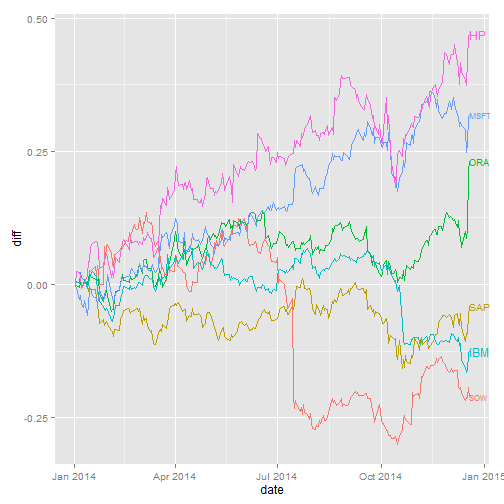

## Agenda

1. Introduction
2. Results
3. Use cases
4. Outlook

--- 

## 1. Introduction

- This slidify deck was created to motivate a shiny app.
- The shiny app in question is available here:
  https://geekbert.shinyapps.io/franksenhancedcourseproject/ 
- it represents an interactive chart to analyse stock prices in software industry, 
  for select stocks (Software AG, SAP, ....)  

---

## 2. Results
 

---

## 3 Further use cases

Further use cases: 
- generic trend analyses: % change over time, compared to peers
- Correlation Analysis: % change over time, including non-peers
- Forecast Functionality 
  
---

## 4 Outlook

Outlook: 
- this kind of application is useful for a wide variety of use cases
- any person making decisions based on analysis would be well advised to have
  this as part of their skills repertoire
- End of Story (EOS)
  
---

